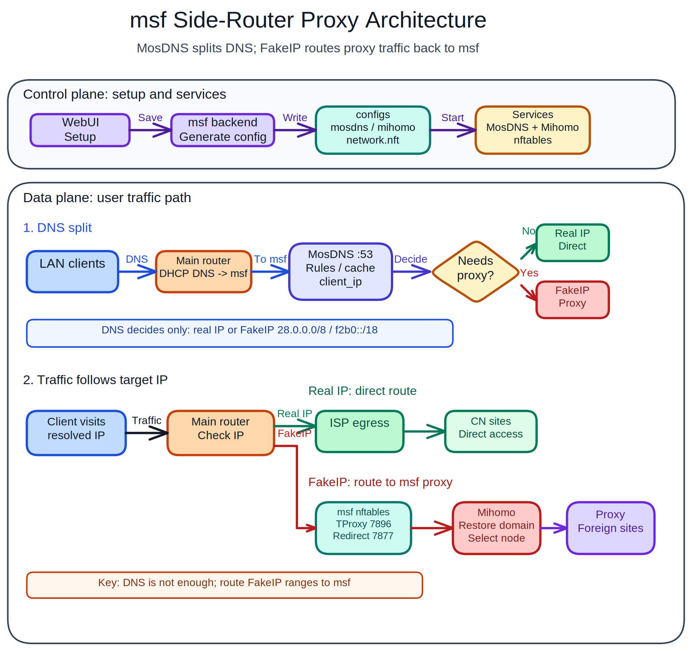

# msf

<p align="center">
  
</p>

[中文 README](README.md)

[FAQ](docs/faq.en.md)

`msf` is an open-source reimplementation of the MSM-style management experience for the MosDNS + Mihomo workflow. It focuses on self-hosted DNS split routing, transparent proxy management, Mihomo management, and platform-native installs.

Current release: `v0.3.9.1`

> **Tip: Cloudflare Redirect is experimental.** The `msf cloudflare-redirect` CLI can rewrite user-selected Cloudflare-protected domains to locally scanned Cloudflare CDN IPv4/IPv6 addresses for direct clients only. Results depend on the msf host's ISP route, Cloudflare Anycast, IPv6 reachability, domain-list quality, and MosDNS config. See [Cloudflare Redirect docs](docs/plugins/cloudflare-redirect.md).

## Features

- MSM-style setup wizard for admin account, system parameters, DNS, IPv6, Fake-IP, transparent proxy, and component installation.
- MosDNS + Mihomo default runtime based on the mssb-style split-flow layout: MosDNS `:53`, Mihomo DNS `:6666`, Fake-IP `28.0.0.0/8`, TProxy `7896`, Redirect `7877`.
- Airport subscriptions, manual nodes, MosDNS client proxy modes, and Mihomo node/rule/connection/log/config pages.
- Mihomo custom configs, CodeMirror YAML editing, component update checks, automatic downloads, update notices, and configurable upgrade behavior.
- Local upload installation for MosDNS, Mihomo, and Zashboard when online downloads are difficult.
- Linux tarball/systemd, fnOS FPK, and Unraid PLG are supported. Docker TUN host/macvlan deployment is currently experimental.
- Docker deployments must mount a host data directory to container `/opt/msf`; the default examples use `./msf-data:/opt/msf`.

## Architecture Diagram

<p align="center">
  
</p>

## Platform Support

| Platform | Status | Install docs | Update / removal |
|---|---|---|---|
| Linux tarball/systemd | Stable | [Linux install](docs/install/linux.md) | `msf update` / `msf uninstall` |
| fnOS FPK | Supported | [fnOS FPK install](docs/install/fnos-fpk.md) | fnOS / Feiniu App Center or FPK package manager |
| Unraid PLG | Stable | [Unraid PLG install](docs/install/unraid-plg.md) | Unraid plugin manager |
| Docker TUN host/macvlan | Experimental, not complete | [Docker experimental deployment](docs/docker.en.md) | Docker / Compose / container manager |

`msf update` and `msf uninstall` are only for Linux tarball/systemd installs. fnOS FPK, Unraid PLG, and Docker installs must be updated or removed through their platform manager.

## Downloads

GitHub Release:

```text
https://github.com/scoltzero/msf/releases/tag/v0.3.9.1
```

| Asset | URL |
|---|---|
| Linux x86_64 | `https://github.com/scoltzero/msf/releases/download/v0.3.9.1/msf-linux-amd64.tar.gz` |
| Linux ARM64 | `https://github.com/scoltzero/msf/releases/download/v0.3.9.1/msf-linux-arm64.tar.gz` |
| fnOS x86 FPK | `https://github.com/scoltzero/msf/releases/download/v0.3.9.1/msf_0.3.9.1_x86.fpk` |
| fnOS ARM FPK | `https://github.com/scoltzero/msf/releases/download/v0.3.9.1/msf_0.3.9.1_arm.fpk` |
| Unraid PLG | `https://github.com/scoltzero/msf/releases/download/v0.3.9.1/msf.plg` |

## Quick Start

1. Pick the install guide for your platform: Linux, fnOS, Unraid, or Docker.
2. Open the WebUI after installation. The default URL is `http://<server-ip>:7777`.
3. Complete the setup wizard. Setup writes system settings, generates MosDNS/Mihomo configs, and persists them in the database.
4. Configure DHCP DNS and FakeIP static routes on your main router so LAN clients can use msf.

Router integration guides:

- [Router integration overview](docs/guide/en/router-integration.md)
- [RouterOS (MikroTik)](docs/guide/en/routeros.md)
- [iKuai](docs/guide/en/ikuai.md)
- [OpenWrt](docs/guide/en/openwrt.md)
- [UniFi (Ubiquiti)](docs/guide/en/unifi.md)

Runtime directories, ports, and file layout are documented in [Runtime reference](docs/reference/runtime.md).

## Plugin Docs

- [Cloudflare Redirect CLI plugin](docs/plugins/cloudflare-redirect.md): rewrites selected Cloudflare-protected domains to locally scanned fast Cloudflare CDN IPv4/IPv6 addresses for direct clients only.

## Development And Release

Run locally:

```bash
go run ./cmd/msf serve -c ./data -p 7777
```

Manual release packaging is documented in [RELEASING.md](RELEASING.md). Unraid packaging development notes remain in [packaging/unraid/README.md](packaging/unraid/README.md).

## Notes

This project does not contain MSM closed-source backend code. It is a non-commercial open reimplementation that references MSM's user-facing experience and rebuilds the backend around the mssb-style MosDNS + Mihomo workflow.

Thanks to:

- [`msm9527/msm-wiki`](https://github.com/msm9527/msm-wiki), used as the public reference for the MSM management experience.
- [`baozaodetudou/mssb`](https://github.com/baozaodetudou/mssb), used as the public reference for the MosDNS + Mihomo backend behavior.
- [Gzh256](https://github.com/Gzh256), with thanks for helping test and validate multiple versions.

This project is not affiliated with the upstream MSM or mssb projects.

[](https://linux.do/)
