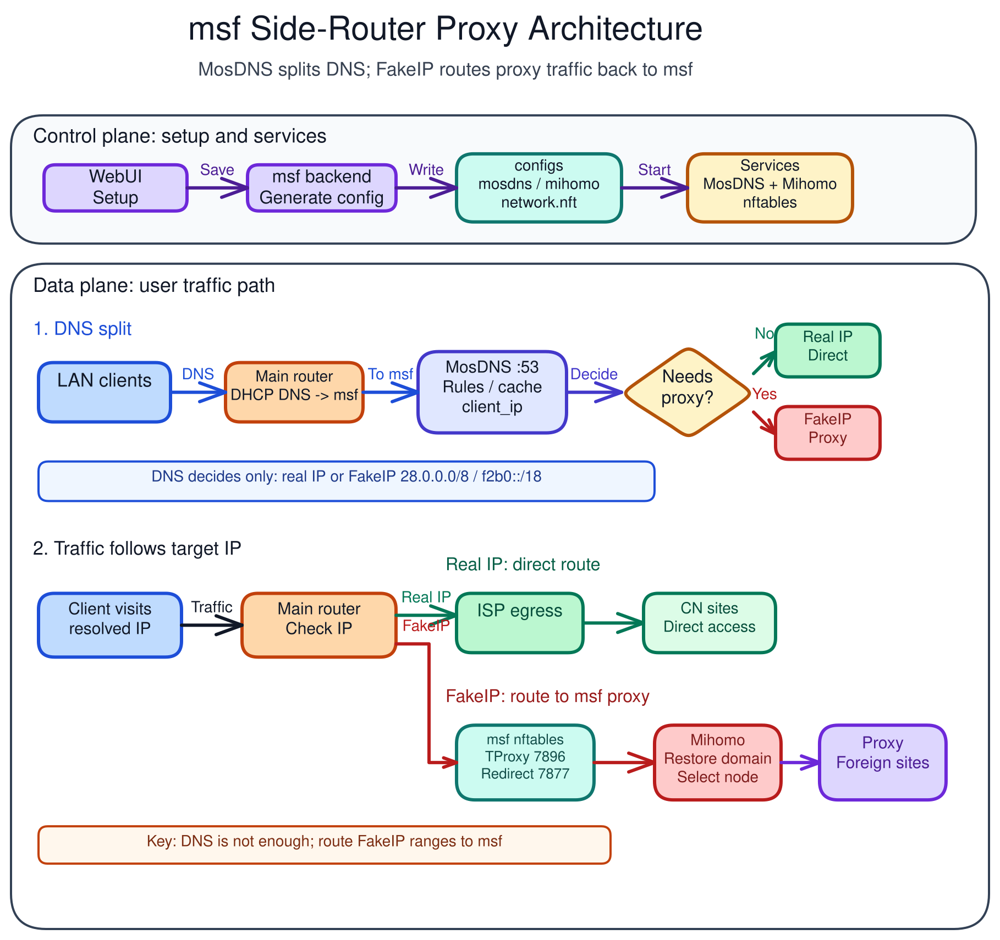

<p align="center">
  
</p>

<h1 align="center">MSF</h1>

<p align="center">
  <strong>A self-hosted, auditable management platform for MosDNS + Mihomo</strong><br>
  Manage DNS policy, traffic forwarding, rules, components, and runtime state for lawful, authorized networks.
</p>

<p align="center">
  <a href="https://github.com/zAhYAng/msf/stargazers"></a>
  <a href="https://github.com/zAhYAng/msf/forks"></a>
  <a href="https://github.com/zAhYAng/msf/releases"></a>
  <a href="https://github.com/zAhYAng/msf/releases/latest"></a>
  <a href="https://discord.gg/Fu3SBgWwRp"></a>
  <a href="LICENSE"></a>
</p>

<p align="center">
  <a href="https://github.com/zAhYAng/msf/releases/latest"></a>
  <a href="docs/install/linux.md"></a>
  <a href="https://discord.gg/Fu3SBgWwRp"></a>
  <a href="#support-msf"></a>
</p>

<p align="center">
  <a href="README.md">中文</a> |
  <a href="docs/faq.en.md">FAQ</a> |
  <a href="DISCLAIMER.md">Disclaimer</a> |
  <a href="THIRD_PARTY_NOTICES.md">Third-party notices</a>
</p>

> [!IMPORTANT]
> MSF does not provide proxy nodes, subscriptions, accounts, access credentials, network lines, or managed proxy services. It does not provide instructions intended to evade network regulation, content filtering, or access controls. Use it only on networks that you own or are fully authorized to administer, and read the [Disclaimer](DISCLAIMER.md) before deployment.

## Why MSF

| Capability | What it provides |
|---|---|
| Unified control | Manage MosDNS, Mihomo, rules, connections, logs, components, device traffic, and system state from one WebUI. |
| Auditable operation | Keep configuration, sources, runtime state, and updates visible instead of hiding the underlying services. |
| Independent implementation | The Go backend, React WebUI, Mizar identity, and Linux control logic are maintained in this repository. |
| Linux-only deployment | Linux amd64 tarball and systemd installation with nftables or TUN support. |
| Configuration ownership | Bring your own subscriptions, manual connections, rule sources, custom Mihomo configuration, and offline components. |
| Clear boundaries | No bundled nodes, accounts, or credentials, with explicit provenance, licensing, and use policies. |

## Supported Platform

| Platform | Status | Install guide | Update and removal |
|---|---|---|---|
| Linux amd64 tarball / systemd | Stable | [Linux install](docs/install/linux.md) | `msf update` / `msf uninstall` |

## Quick Start

1. Download the Linux amd64 package from [Latest Release](https://github.com/zAhYAng/msf/releases/latest).
2. Follow the [Linux install guide](docs/install/linux.md).
3. Open `http://<server-ip>:7788` and complete the four-step setup flow.
4. Configure DHCP DNS and the Fake-IP static route only on a router you own or are authorized to manage.

<details>
<summary><strong>Show release asset names</strong></summary>

| Platform | Release asset |
|---|---|
| Linux x86_64 / amd64 | `msf-linux-amd64.tar.gz` |

Every formal asset should correspond to the same Git tag and include a SHA-256 checksum file.

</details>

## Architecture

<p align="center">
  
</p>

The default chain combines MosDNS `:53`, Mihomo DNS `:6666`, Fake-IP, and either TProxy / Redirect or TUN. The mode is selected during Linux setup.

## Documentation

| Category | Documentation |
|---|---|
| Router integration | [Overview](docs/guide/en/router-integration.md)<br>[RouterOS](docs/guide/en/routeros.md)<br>[iKuai](docs/guide/en/ikuai.md)<br>[OpenWrt](docs/guide/en/openwrt.md)<br>[UniFi](docs/guide/en/unifi.md) |
| Runtime reference | [Directories, ports, and file layout](docs/reference/runtime.md) |
| Plugin | [Cloudflare Redirect](docs/plugins/cloudflare-redirect.md) |
| FAQ | [Frequently asked questions](docs/faq.en.md) |
| Release engineering | [RELEASING.md](RELEASING.md) |

> [!NOTE]
> Cloudflare Redirect is experimental. Results depend on the host network, ISP route, Cloudflare Anycast, IPv6 reachability, domain lists, and active MosDNS configuration. It is not guaranteed to be faster or more stable in every environment.

## Use Boundaries

- Users or relevant third parties supply imported subscriptions, connections, rules, configuration, and external content.
- Users must independently verify the source, authorization, legality, and security of external material.
- Maintainers do not provide individualized configuration, remote deployment, or troubleshooting intended to evade regulation or access controls.
- Linux tarball / systemd installs may use `msf update` and `msf uninstall`.

<details>
<summary><strong>Public references, cross-language reimplementation, and copyright boundary</strong></summary>

Studying publicly accessible source code to understand its functions, processing flow, and operating methods, and then independently redesigning and implementing those functions in another programming language, is not unlawful by itself and does not automatically constitute copyright infringement. Software copyright protects concrete program expression. It does not grant a monopoly over ideas, functions, processing methods, operating methods, compatibility interfaces, or configuration structures constrained by common upstream projects.

During early development, MSF consulted the MosDNS + Mihomo workflow shown by the publicly accessible implementation of [`baozaodetudou/mssb`](https://github.com/baozaodetudou/mssb), then used Go to reimplement, redesign, optimize, and extend the management backend and control plane. mssb primarily organizes installation and runtime behavior through Shell/Python scripts and configuration files. MSF uses an independent Go service architecture, database model, HTTP API, configuration transactions, state recovery, component management, and Linux runtime logic.

The current file-by-file audit found no mssb Shell/Python program source included or distributed by MSF, and no line-by-line translation or direct copying of that program code. Shared MosDNS/Mihomo fields, plugin types, ports, rule formats, and required processing steps primarily arise from common upstreams, standard interfaces, functional constraints, and configuration structures with limited practical expression. The real upstream sources and licenses for relevant templates and rule data are recorded individually.

On the current audited code, this cross-language reimplementation of publicly visible functional behavior does not infringe mssb software copyright and is not unlawful merely because that public implementation was consulted. This assessment is limited to the code, configuration, and assets actually audited in the current repository.

MSF-authored code is distributed under GNU GPL v3.0. Third-party code, data, and assets remain subject to their respective upstream licenses and are not relicensed merely because they are included, invoked, or distributed with MSF.

</details>

## Sources And Acknowledgements

MSF thanks the following projects and maintainers for publishing implementations, interfaces, data, or assets. File-level mappings and full license notices are in [THIRD_PARTY_NOTICES.md](THIRD_PARTY_NOTICES.md).

| Project | Contribution to MSF | License or status |
|---|---|---|
| [baozaodetudou/mssb](https://github.com/baozaodetudou/mssb) | Early public functional reference for the combined MosDNS + Mihomo workflow; MSF redesigned and implemented the management backend and control plane in Go. | Publicly accessible reference, not the license source for MSF code |
| [yyysuo/mosdns](https://github.com/yyysuo/mosdns) | MosDNS core, extension plugin types, and interfaces | GPL-3.0 |
| [yyysuo/firetv](https://github.com/yyysuo/firetv) | Some MosDNS configuration and rule material | GPL-3.0 |
| [MetaCubeX/mihomo](https://github.com/MetaCubeX/mihomo) | Mihomo core, Controller API, and configuration format | MIT |
| [MetaCubeX/meta-rules-dat](https://github.com/MetaCubeX/meta-rules-dat) | GeoIP, Geosite, and rule-set data | GPL-3.0 |
| [Loyalsoldier/domain-list-custom](https://github.com/Loyalsoldier/domain-list-custom) | Optional remote domain rule source | MIT |
| [Zephyruso/zashboard](https://github.com/Zephyruso/zashboard) | Connection rendering, Earth visualization, and interaction foundations | MIT |
| [React Bits](https://github.com/DavidHDev/react-bits) | `GradientWaves` and `GlassSurface` | MIT + Commons Clause |
| [Solar System Scope](https://www.solarsystemscope.com/textures/) / [Three.js](https://threejs.org/) / [DB-IP](https://db-ip.com/) | Earth textures, rendering examples, and optional GeoIP data | CC BY 4.0 / MIT / CC BY 4.0 |
| [nolangz/pixel2motion](https://github.com/nolangz/pixel2motion) | Mizar SVG fitting and brand-motion tooling | MIT |
| [Gzh256](https://github.com/Gzh256) | Multi-release testing and validation | Acknowledgement |

These acknowledgements describe provenance and contributions only. They do not imply affiliation, authorization, partnership, or official endorsement. See [BRAND_POLICY.md](BRAND_POLICY.md) for use of the MSF name and Mizar identity.

<a id="support-msf"></a>

## Support MSF

If MSF is useful to you, support the project with a Star, issue reports, documentation improvements, testing, or maintenance sponsorship.

<p align="center">
  <a href="https://github.com/zAhYAng/msf/stargazers"></a>
  <a href="https://discord.gg/Fu3SBgWwRp"></a>
</p>

<details>
<summary><strong>Alipay sponsorship</strong></summary>

<p align="center">Sponsorship is not available yet. It may be enabled after the formal v1.0.0 release.</p>

</details>

## Development

```bash
go run ./cmd/msf serve -c ./data -p 7788
```

See [RELEASING.md](RELEASING.md) for release engineering.

## License

- MSF-authored code: [GNU GPL v3.0](LICENSE)
- Third-party code, data, and assets: [THIRD_PARTY_NOTICES.md](THIRD_PARTY_NOTICES.md)
- MSF name and Mizar identity: [BRAND_POLICY.md](BRAND_POLICY.md)

<p align="center">
  <a href="https://linux.do/"></a>
</p>
