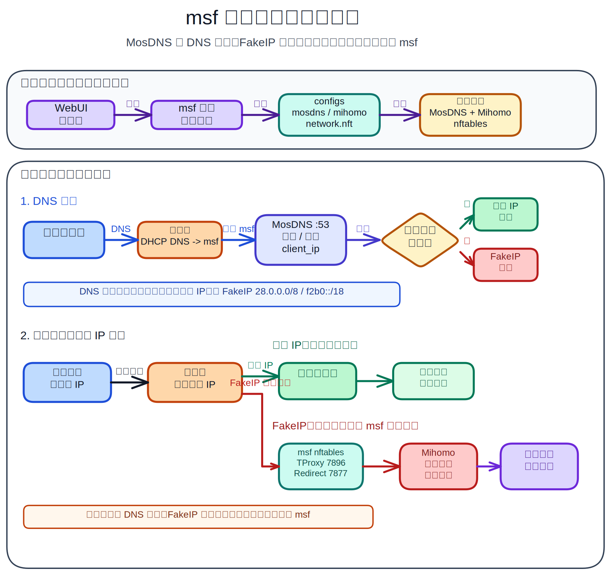

# msf

<p align="center">
  
</p>

[English README](README.en.md)

[常见问题 FAQ](docs/faq.md)

`msf` 是一个面向 MosDNS + Mihomo 工作流的 MSM 风格管理面板重构版。项目目标是提供可自部署、可审计的 DNS 分流、透明代理、Mihomo 管理和多平台安装体验。

当前发布版本：`v0.3.9.1`

> **提示：Cloudflare Redirect CLI 插件为测试功能。** 它用于让“不走代理的客户端”访问用户指定的 Cloudflare 盾站时，返回本机网络实测较快的 Cloudflare CDN IPv4/IPv6。该功能依赖本机网络、运营商路由、Cloudflare Anycast、域名名单质量和 MosDNS 当前配置，不保证一定比原解析更快或更稳定。详细用法见 [Cloudflare Redirect 文档](docs/plugins/cloudflare-redirect.md)。

## 功能概览

- 原版 MSM 风格 6 步初始化向导，覆盖管理员账号、系统参数、DNS、IPv6、Fake-IP、透明代理和组件安装配置。
- MosDNS + Mihomo 默认组合，按 mssb 风格生成国内外分流链路：MosDNS `:53` 入口，Mihomo DNS `:6666`，Fake-IP `28.0.0.0/8`，TProxy `7896`，Redirect `7877`。
- 支持机场订阅、手动节点、MosDNS 客户端代理模式、Mihomo 节点/规则/连接/日志/配置页面。
- 支持 Mihomo 自定义配置、CodeMirror YAML 编辑器、组件更新检查、自动下载、更新通知和升级方式配置。
- 支持 MosDNS、Mihomo、Zashboard 本地上传安装，网络困难时可用预下载核心离线安装。
- 支持 Linux tarball/systemd、fnOS FPK、Unraid PLG；Docker TUN host/macvlan 当前为实验部署。
- Docker 部署必须把宿主机数据目录映射到容器 `/opt/msf`，默认示例使用 `./msf-data:/opt/msf`。

## 架构原理图

<p align="center">
  
</p>

## 平台支持

| 平台 | 状态 | 安装文档 | 更新/卸载方式 |
|---|---|---|---|
| Linux tarball/systemd | 稳定支持 | [Linux 安装](docs/install/linux.md) | `msf update` / `msf uninstall` |
| fnOS FPK | 支持 | [fnOS FPK 安装](docs/install/fnos-fpk.md) | fnOS / 飞牛应用中心或 FPK 包管理器 |
| Unraid PLG | 稳定支持 | [Unraid PLG 安装](docs/install/unraid-plg.md) | Unraid 插件管理页面 |
| Docker TUN host/macvlan | 实验性，未完全完成 | [Docker 实验部署](docs/docker.md) | Docker / Compose / 容器管理器 |

`msf update` 和 `msf uninstall` 只面向 Linux tarball/systemd 安装。fnOS FPK、Unraid PLG、Docker 请通过各自平台管理器更新或卸载，避免绕过包状态。

## 下载

GitHub Release：

```text
https://github.com/scoltzero/msf/releases/tag/v0.3.9.1
```

| 资产 | 下载地址 |
|---|---|
| Linux x86_64 | `https://github.com/scoltzero/msf/releases/download/v0.3.9.1/msf-linux-amd64.tar.gz` |
| Linux ARM64 | `https://github.com/scoltzero/msf/releases/download/v0.3.9.1/msf-linux-arm64.tar.gz` |
| fnOS x86 FPK | `https://github.com/scoltzero/msf/releases/download/v0.3.9.1/msf_0.3.9.1_x86.fpk` |
| fnOS ARM FPK | `https://github.com/scoltzero/msf/releases/download/v0.3.9.1/msf_0.3.9.1_arm.fpk` |
| Unraid PLG | `https://github.com/scoltzero/msf/releases/download/v0.3.9.1/msf.plg` |

## 快速开始

1. 按你的运行平台选择安装文档：Linux、fnOS、Unraid 或 Docker。
2. 安装后打开 WebUI，默认地址是 `http://<服务器IP>:7777`。
3. 完成初始化向导。首次初始化会写入系统配置、生成 MosDNS/Mihomo 配置，并保存到数据库。
4. 在主路由上配置 DHCP DNS 和 FakeIP 静态路由，让局域网客户端流量进入 msf。

路由器接入教程：

- [路由器接入总览](docs/guide/zh/router-integration.md)
- [RouterOS（MikroTik）](docs/guide/zh/routeros.md)
- [爱快 iKuai](docs/guide/zh/ikuai.md)
- [OpenWrt](docs/guide/zh/openwrt.md)
- [UniFi（Ubiquiti）](docs/guide/zh/unifi.md)

运行目录、端口和文件结构见 [运行参考](docs/reference/runtime.md)。

## 插件文档

- [Cloudflare Redirect CLI 插件](docs/plugins/cloudflare-redirect.md)：为“不走代理的客户端”把指定 Cloudflare 盾站重定向到本机实测较快的 Cloudflare CDN IPv4/IPv6。

## 开发与发布

本地运行：

```bash
go run ./cmd/msf serve -c ./data -p 7777
```

发布打包流程见 [RELEASING.md](RELEASING.md)。Unraid 打包开发说明见 [packaging/unraid/README.md](packaging/unraid/README.md)。

## 说明

`msf` 不包含 MSM 的闭源后端代码。项目目标是做一个非商业用途的开放重构版：外观和使用体验参考 MSM，后端行为围绕 mssb 风格的 MosDNS + Mihomo 工作流重新实现。

## 鸣谢

感谢这些项目提供参考：

- [`msm9527/msm-wiki`](https://github.com/msm9527/msm-wiki)：作为 MSM 管理体验和功能组织的公开参考。
- [`baozaodetudou/mssb`](https://github.com/baozaodetudou/mssb)：作为 MosDNS + Mihomo 后端工作流的公开参考。
- [Gzh256](https://github.com/Gzh256)：感谢协助测试和验证多个版本。

本项目与 MSM、mssb 上游项目没有隶属关系。

[](https://linux.do/)
